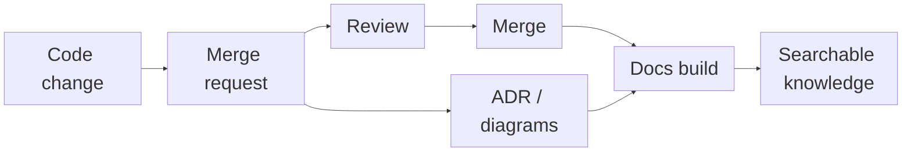
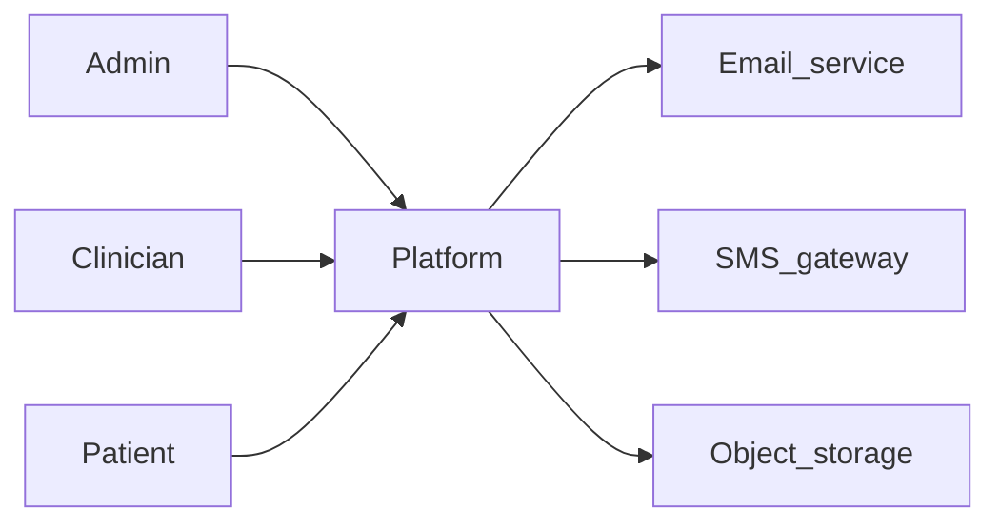
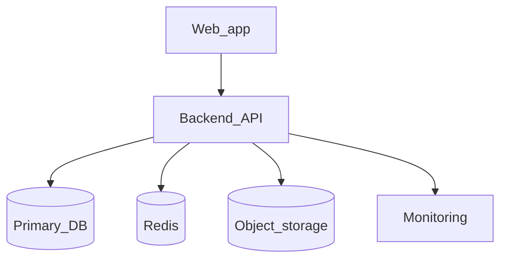
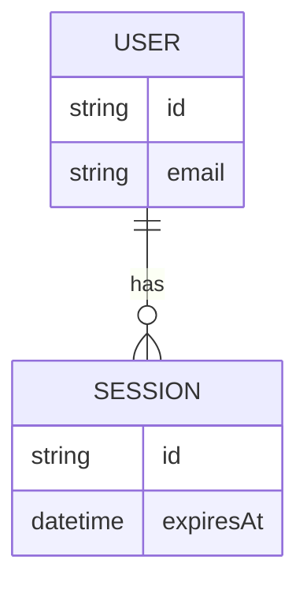
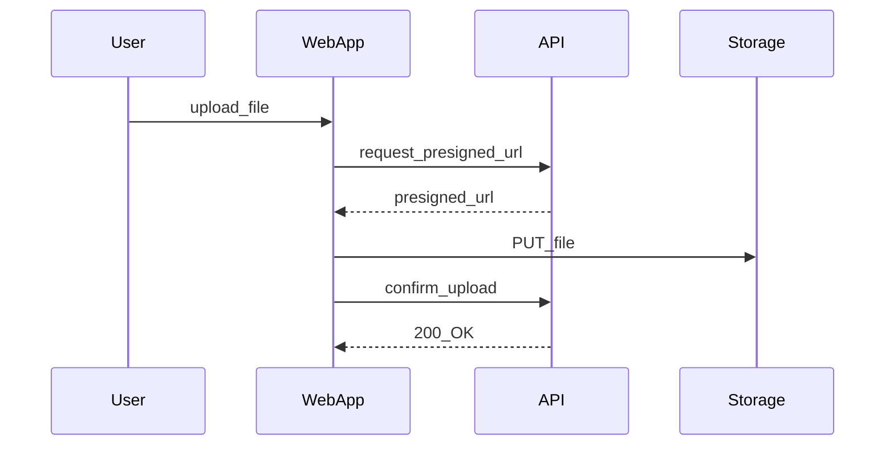
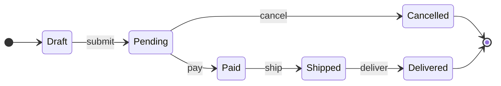
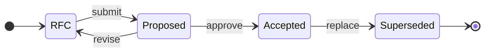
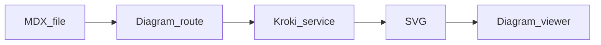
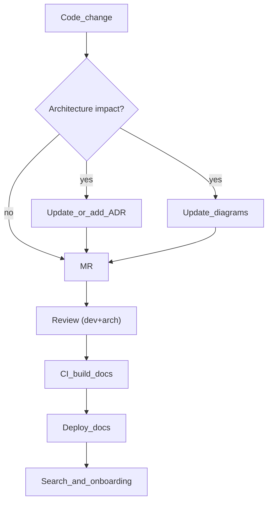

<div class="h-full w-full flex flex-col justify-center items-center text-center">

# Architecture as Code

## Як зробити архітектуру живою частиною розробки

<div class="mt-10 text-sm opacity-80">
  Vadym • 2026
</div>

</div>

<!--
Таймінг 30 хв (орієнтовно):
- 0–3: проблема і визначення
- 3–12: мінімальний набір артефактів + структура репо
- 12–18: C4/seq/ERD/state machine як код (діаграми)
- 18–20: Tech stack / Infra / Solutions
- 20–25: ADR і solution/
- 25–29: tooling (Fumadocs) + як зробити процес сталим + пастки
- 29–30: план впровадження + CTA + питання
-->

---
layout: default
---

<div class="mb-8">
  <h2 class="!mb-0">Кейс: Treemily (довготривалий проєкт)</h2>
</div>

- Проєкт тривав **роками**
- Цілісної архітектурної документації **не було**
- Архітектурні рішення жили “в головах” і в історії змін коду

<!--
2:00–2:40. Контекст: чому це взагалі стало проблемою.
-->

---
layout: default
---

<div class="mb-8">
  <h2 class="!mb-0">Онбординг без документації = висока вартість контексту</h2>
</div>

Коли нова людина питає “чому тут так?”, типові відповіді:
- **ніхто вже не памʼятає**
- **сідай — зараз розкажу історію**

Наслідки:
- повільніший онбординг
- більший bus factor
- вища ціна помилки

<!--
2:40–3:30. Показати pain без емоційної лексики.
-->

---
layout: default
---

<div class="mb-8">
  <h2 class="!mb-0">Травень 2025: “зробіть архітектурну документацію"</h2>
</div>

І виявилось, що потрібно:
- відновлювати контекст “з нуля” (рішення, інтеграції, межі компонентів)
- узгоджувати “мінімальний набір” артефактів
- визначити, **що саме** документувати

<div class="mt-8 p-5 rounded-xl bg-primary/15 border-2 border-primary/40 text-lg font-semibold">

**Висновок:** якщо архітектура не збирається **поступово**, одним таском її не “наздоженеш”.
</div>

<!--
3:30–4:10. Тригер, який змусив переосмислити підхід.
-->

---
layout: default
---

<div class="mb-8">
  <h2 class="!mb-0">Спочатку думали: Google Docs або Confluence</h2>
</div>

- Це звучить логічно: “напишемо один документ і буде ок”
- Але далі починається реальність:
  - немає природного **code review**
  - немає “diff” поруч із зміною в коді
  - важко тримати **актуальність**
  - нові люди не знають, **де шукати правду**
- **2026:** AI-асистенти можуть генерувати/оновлювати документацію — але їм потрібен **доступ до коду**; у вікі його немає, у репо — є

<!--
3:40–4:30. Показати, чому “звичайна вікі” не рятує.
-->

---
layout: default
---

<div class="mb-8">
  <h2 class="!mb-0">Architecture as Code</h2>
</div>

це підхід, коли архітектурні знання:

- зберігаються **в репозиторії** поруч із кодом
- проходять **ревʼю** як частина MR
- мають **історію змін** (git diff + blame)
- можуть перевірятись у **CI** (лінки, структура, генерація)

Результат: документація стає **частиною delivery**, а не “окремою ініціативою”.

---
layout: default
---

<div class="mb-8">
  <h2 class="!mb-0">Architecture as Code — як це працює</h2>
</div>

<!-- <div class="grid place-content-center min-h-[65vh] [&_.slidev-code]:!scale-[1.75]"> -->



<!-- </div> -->

<!--
4:30–5:30. Визначення + коротко “як це працює”.
-->

---
layout: two-cols-header
---

<div class="mb-8">
  <h2 class="!mb-2">Scope: про що це, а про що ні</h2>
  <p class="text-sm opacity-85 m-0">Чіткі межі підходу — щоб не було хибних очікувань</p>
</div>

::left::
#### У фокусі
- **Памʼять рішень** — ADR як частина MR
- **Спільні моделі** — C4, sequence, ERD (як код)
- **Словник термінів** — glossary = спільна мова
- **Процес і ownership** — хто оновлює, коли й як

::right::
#### Поза scope
- «Один великий документ на 100 сторінок»
- «Одна діаграма на старті проєкту»
- «Замінити дизайн чи код» — це доповнення, не заміна

<!--
4:00–5:00. Зняти хибні очікування.
-->

---
layout: default
---

<div class="mb-8">
  <h2 class="!mb-0">Артефакти, які ми вже впровадили</h2>
</div>

Мінімальний набір, який реально підтримується в роботі:

- **Glossary** — спільний словник термінів; домовленості команди як контракт
- **C4** — контекст і контейнери (C1 + C2) як основа архітектурної карти
- **ERD** — модель даних як джерело правди (у т.ч. для комплаєнсу)
- **Sequence + state machine** — ключові сценарії та життєвий цикл сутностей
- **Tech stack** — зафіксований стек і обґрунтування вибору
- **ADR** — архітектурні рішення та trade-offs (детальніше далі в презентації)

<!--
5:00–6:30. Пояснити “мінімум, який дає максимум”.
-->

---
layout: default
---

<div class="mb-8">
  <h2 class="!mb-0">Як це виглядає в репо (приклад структури)</h2>
</div>

```text
docs/
  content/docs/
    architecture/
      glossary/
      c4/
        c1.mdx
        c2.mdx
        c3/
      erd/
      seq/
      state-machine/
      tech-stack.mdx
      infrastructure.mdx
      solutions/
      adr/
        general/
        backend/
        data/
        security/
        infrastructure/
    process/
    api/
```

<!--
6:30–7:30. Показати, що це “звичайні файли”.
-->

---
layout: section
---

# Glossary

### терміни — це API вашої команди

<!-- 7:30–7:40 -->

---
layout: two-cols-header
---

<div class="mb-8">
  <h2 class="!mb-0">Glossary: чому ставимо першим</h2>
</div>

::left::
- Менше непорозумінь у MR/ревʼю (“actor”, “tenant”, “role”…)
- Швидший онбординг: “що означає слово X?”
- Єдине місце, де фіксуємо **доменно-специфічні** терміни
- Тримайте коротким: 1–3 речення + приклад + посилання

Ключ: термін у glossary має **посилатися** на діаграми/ADR, а не дублювати їх.

::right::
```md
### ClinicAdmin
Адміністратор, який керує налаштуваннями клініки.

**Не плутати з**: SuperAdmin
**Дивись також**: C4_C1, Tech_Stack
```

<!--
8:40–10:00. Glossary як фундамент для діаграм і ADR.
-->

---
layout: default
---

<div class="mb-8">
  <h2 class="!mb-0">Коли додавати та оновлювати терміни в glossary</h2>
</div>

- Зʼявився новий **actor / role / permission**
- Зʼявилась нова **сутність, стан або етап процесу**
- У MR або ревʼю виникли суперечки щодо назви — зафіксуйте термін
- Термін пішов у **API, БД або UI** — задекларуйте офіційну назву в glossary
- Є синоніми або схожі терміни — додайте блок «Не плутати з»

<!--
10:00–10:45. “Тригери” роблять glossary живим.
-->

---
layout: section
---

# Діаграми як код

### C4, ERD, sequence, state machine

<!-- 12:00–12:10 -->

---
layout: default
---

<div class="mb-8">
  <h2 class="!mb-0">C4 в 60 секунд</h2>
</div>

<div class="absolute top-8 right-10 opacity-95">
  
</div>

- **C1 (Context)**: актори + зовнішні інтеграції
- **C2 (Containers)**: з чого складається система (API, UI, DB, queue…)
- **C3 (Components)**: великі блоки всередині контейнерів

Ціль: **спільна модель** для розмов і рішень.

<!--
12:10–13:10. Дуже коротко.
-->

---
layout: two-cols
---

<div class="mb-8">
  <h2 class="!mb-0">C1: System Context (спрощений приклад)</h2>
</div>

::left::
Сильна сторона C1:

- одразу видно інтеграції
- одразу видно “хто наші користувачі”
- легше пояснювати “що ми будуємо”

::right::


<!--
13:10–14:30.
-->

---
layout: two-cols
---

<div class="mb-8">
  <h2 class="!mb-0">C2: Containers (спрощений приклад)</h2>
</div>

::left::
Що дає C2:

- залежності між “великими частинами”
- де живуть дані
- де кеш/черги/обсервабіліті

::right::


<!--
14:30–15:45.
-->

---
layout: two-cols-header
---

<div class="mb-8">
  <h2 class="!mb-0">ERD: де дані — там і архітектура</h2>
</div>

::left::
- **ERD (Entity-Relationship Diagram)** — модель сутностей і звʼязків (таблиці, моделі, відносини)
- Особливо корисна при **аудиті**, **комплаєнсі** та складних доменних залежностях
- Файл у репо → ревʼю в MR, diff, повна історія змін

<div class="mt-4 text-sm opacity-90 border-l-2 border-primary/40 pl-4">ERD не замінює міграції, але фіксує “неочевидних” звʼязки і стає джерелом правди для команди.</div>

::right::


<!--
15:45–16:30. Після C4: дані та звʼязки як основа для розмов.
-->

---
layout: two-cols-header
---

<div class="mb-8">
  <h2 class="!mb-0">Sequence: критичний флоу як код</h2>
</div>

::left::
**Що варто документувати**
- Авторизація та відновлення доступу (login, forgot password)
- Завантаження великих файлів (presigned URL, підтвердження)
- Критичні бізнес-флоу (consent, audit)

**Навіщо** — видно учасників, порядок викликів і місця гарантій; допомагає **обговорити з фронтендом**, як реалізовувати флоу (контракт між командами).

::right::


<!--
16:30–17:30.
-->

---
layout: default
---

<div class="mb-6">
  <h2 class="!mb-0">State machine: дозволені переходи як контракт</h2>
</div>

**State machine** — опис станів сутності та **дозволених переходів** між ними.

**Навіщо**
- Спільний **контракт** для backend, frontend і QA — усі знають, які переходи валідні
- Усуває “тихих” баги: неможливо потрапити в стан, якого не передбачено
- Спрощує валідації, edge-cases і тести

**Приклад** — життєвий цикл замовлення (Order): кожен крок і відміна явно описані.





<!--
17:30–18:15. Завершуємо блок: transitions як контракт.
-->

---
layout: section
---

# Tech stack / Infrastructure / Solutions

### артефакти "після діаграм" у навігації

<!-- 24:00–24:10 -->

---
layout: default
---

<div class="mb-8">
  <h2 class="!mb-0">Tech stack</h2>
  <p class="text-sm opacity-85 mt-1 m-0">одна сторінка: що використовуємо і чому</p>
</div>

- Фіксуємо **стек** (мови, фреймворки, БД, черги тощо) і **обґрунтування вибору**
- Лінки на **ADR**, де прийняті ключові технічні рішення
- Один документ — один джерело правди для онбордингу і оцінок

<p class="mt-6 text-sm opacity-85 border-l-2 border-primary/40 pl-4">У навігації (<code>meta.json</code>) Tech stack, Infra і Solutions йдуть <strong>перед ADR</strong> — створюють контекст для рішень.</p>

<!--
24:10–25:15. Коротко: ці сторінки дають контекст, без якого ADR буде “в повітрі”.
-->

---
layout: default
---

<div class="mb-8">
  <h2 class="!mb-0">Infrastructure</h2>
  <p class="text-sm opacity-85 mt-1 m-0">середовища, пайплайни, спостереження</p>
</div>

- **Середовища** — dev, staging, prod; хостинг, контейнери
- **CI/CD** — збірка, деплой, артефакти
- **Observability** — логи, метрики, трейсинг
- **Compliance** — обмеження (регіони, шифрування, збереження даних)

<p class="mt-6 text-sm opacity-85">Без цього контексту ADR про інфраструктурні рішення висять «в повітрі».</p>

---
layout: default
---

<div class="mb-8">
  <h2 class="!mb-0">Solutions</h2>
  <p class="text-sm opacity-85 mt-1 m-0">повторювані рішення для cross-cutting concerns</p>
</div>

- **Auth** — хто як авторизується, інтеграції (OAuth, SSO)
- **Audit** — що логуємо, де зберігаємо
- **Encryption** — at rest, in transit; ключі
- **Uploads / file handling** — пресайни, валідація, storage

<p class="mt-6 text-sm opacity-85">Короткі сторінки з посиланнями на ADR і діаграми, де це описано детальніше.</p>

---
layout: section
class: text-center
---

<div class="flex flex-col items-center justify-center w-full">

# ADR

<p class="text-lg opacity-90 mt-3 mb-0">Architecture Decision Record — запис архітектурного рішення</p>

</div>

<!-- 25:15–25:25 -->

---
layout: two-cols-header
---

<div class="mb-6">
  <h2 class="!mb-0">ADR: що всередині і коли писати</h2>
  <p class="text-sm opacity-85 mt-1 m-0">структура документа і тригери</p>
</div>

::left::
**Коли потрібен ADR**
- Зміна **boundaries** або контрактів між сервісами
- Новий інфраструктурний компонент (черги, кеш, observability)
- Вибір технології або підходу «надовго»

**Наслідки = чесні trade-offs**
- **Positive** / **Negative** / **Risks** — без прикрас

::right::
<div class="text-xs opacity-90">
**Шаблон ADR**
</div>
```md
---
title: "ADR-XXX: коротка назва"
status: Proposed
---

## Context
...

## Decision
...

## Consequences
### Positive / Negative / Risks
...
```

---
layout: default
---

<div class="mb-6">
  <h2 class="!mb-0">ADR: життєвий цикл</h2>
</div>

- **RFC** → **Proposed** → **Accepted** → **Superseded**
- Це не бюрократія: це контроль **стану знання**



---
layout: default
---

<div class="mb-8">
  <h2 class="!mb-0">Process doc</h2>
  <p class="text-sm opacity-85 mt-1 m-0">процес у репо — не тільки pipeline, а й документація</p>
</div>

**Що це** — опис робочих процесів команди в тому ж репо, що й код і архітектура: git workflow, гілки, MR, ревʼю, CI/CD з точки зору «як ми працюємо».

**Що робимо** — фіксуємо в `process/`: як ведемо гілки, коли мержимо, як працює пайплайн (збірка, тести, деплой). Оновлюємо разом із змінами в CI; нові люди читають один джерело правди.

---
layout: default
---

<div class="mb-8">
  <h2 class="!mb-0">API Doc</h2>
  <p class="text-sm opacity-85 mt-1 m-0">API-документація як код — одна специфікація, один сайт</p>
</div>

**Що це** — опис API (ендпоінти, контракти, приклади) у вигляді коду в репо: OpenAPI/Swagger-файл або генерація з коду. Частина архітектурної документації, а не окремий сервіс.

**Що робимо** — тримаємо специфікацію в репо (наприклад `open_api/api-doc.yaml`), збираємо з неї сторінки в тому ж docs-сайті, де C4, ADR, glossary. Зміни в API = MR з оновленням специфікації; фронт і партнери беруть контракт звідти.

---
layout: section
---

# Tooling

### Чому Fumadocs

<!-- 26:15–26:25 -->

---
layout: default
---

<div class="mb-6">
  <h2 class="!mb-0">Вибір tooling: порівняння характеристик</h2>
</div>

<table class="text-sm">
  <thead>
    <tr>
      <th class="text-left pr-4">Критерій</th>
      <th class="text-left px-2"> <a href="https://www.mkdocs.org/" target="_blank" rel="noopener">MkDocs</a></th>
      <th class="text-left px-2"> <a href="https://docusaurus.io/" target="_blank" rel="noopener">Docusaurus</a></th>
      <th class="text-left px-2"> <a href="https://nextra.site/" target="_blank" rel="noopener">Nextra</a></th>
      <th class="text-left px-2 bg-primary/15 border-l-2 border-primary rounded-r"> <a href="https://www.fumadocs.dev/" target="_blank" rel="noopener">Fumadocs</a> <span class="text-primary font-medium">✓ обрано</span></th>
    </tr>
  </thead>
  <tbody>
    <tr>
      <td class="pr-4 py-1"><strong>Стек</strong></td>
      <td class="px-2 py-1">Python, Markdown + YAML</td>
      <td class="px-2 py-1">React (Meta)</td>
      <td class="px-2 py-1">Next.js + MDX</td>
      <td class="px-2 py-1 bg-primary/15 border-l-2 border-primary">Next.js + MDX</td>
    </tr>
    <tr>
      <td class="pr-4 py-1"><strong>OpenAPI / REST API</strong></td>
      <td class="px-2 py-1">—</td>
      <td class="px-2 py-1">плагіни</td>
      <td class="px-2 py-1">—</td>
      <td class="px-2 py-1 bg-primary/15 border-l-2 border-primary">✓ з коробки</td>
    </tr>
    <tr>
      <td class="pr-4 py-1"><strong>Кастомізація</strong></td>
      <td class="px-2 py-1">теми, плагіни</td>
      <td class="px-2 py-1">плагіни, теми</td>
      <td class="px-2 py-1">конфіг, опінійований</td>
      <td class="px-2 py-1 bg-primary/15 border-l-2 border-primary">повний контроль, «framework you can break»</td>
    </tr>
    <tr>
      <td class="pr-4 py-1"><strong>Навігація</strong></td>
      <td class="px-2 py-1">YAML</td>
      <td class="px-2 py-1">конфіг</td>
      <td class="px-2 py-1"><code>meta.json</code></td>
      <td class="px-2 py-1 bg-primary/15 border-l-2 border-primary"><code>meta.json</code></td>
    </tr>
    <tr>
      <td class="pr-4 py-1"><strong>Пошук</strong></td>
      <td class="px-2 py-1">плагіни (lunr, Material)</td>
      <td class="px-2 py-1">вбудований, Algolia</td>
      <td class="px-2 py-1">flexsearch / плагіни</td>
      <td class="px-2 py-1 bg-primary/15 border-l-2 border-primary">✓ з коробки</td>
    </tr>
  </tbody>
</table>

---
layout: default
---

<div class="mb-6">
  <h2 class="!mb-0">Вибір tooling для діаграм</h2>
  <p class="text-sm opacity-85 mt-1 m-0">Mermaid, PlantUML, Structurizr DSL · рендер через <a href="https://kroki.io/" target="_blank" rel="noopener">Kroki</a></p>
</div>

<table class="text-sm">
  <thead>
    <tr>
      <th class="text-left pr-4">Критерій</th>
      <th class="text-left px-2"> <a href="https://mermaid.js.org/" target="_blank" rel="noopener">Mermaid</a></th>
      <th class="text-left px-2"> <a href="https://plantuml.com/" target="_blank" rel="noopener">PlantUML</a></th>
      <th class="text-left px-2"> <a href="https://structurizr.com/" target="_blank" rel="noopener">Structurizr DSL</a></th>
    </tr>
  </thead>
  <tbody>
    <tr>
      <td class="pr-4 py-1"><strong>Залежності для рендеру</strong></td>
      <td class="px-2 py-1">JS (браузер), без сервера</td>
      <td class="px-2 py-1">потрібна <strong>Java</strong></td>
      <td class="px-2 py-1">окремий рушій / сервіс</td>
    </tr>
    <tr>
      <td class="pr-4 py-1"><strong>C4 / архітектура</strong></td>
      <td class="px-2 py-1">плагіни, обмежено</td>
      <td class="px-2 py-1">C4-PlantUML</td>
      <td class="px-2 py-1">C4 нативно</td>
    </tr>
    <tr>
      <td class="pr-4 py-1"><strong>У нашому пайплайні</strong></td>
      <td class="px-2 py-1">нативно (в браузері)</td>
      <td class="px-2 py-1">через Kroki (не тягнемо Java в CI)</td>
      <td class="px-2 py-1">через Kroki</td>
    </tr>
  </tbody>
</table>

**Чому Kroki** — для PlantUML потрібна Java; для Structurizr — окремий рушій. [Kroki](https://kroki.io/) дає один API для всіх форматів (Mermaid, PlantUML, Structurizr, GraphViz, D2…), хостований або self-hosted, без Java та додаткових залежностей у нашому CI.

---
layout: default
---

<div class="mb-8">
  <h2 class="!mb-0">Mermaid + PlantUML: коли що використовувати</h2>
</div>

- **Mermaid** — прості діаграми без сервера: flow, sequence, ER, діаграми станів; швидкий набір, перегляд у браузері; ідеально для README, ADR, швидких скетчів
- **PlantUML** — складніші та C4: контекст/контейнери/компоненти, діаграми класів, детальні sequence; коли потрібна повнота нотації або C4-стандарт, рендер через Kroki

Коротко: Mermaid для швидкого й простого, PlantUML — коли потрібна потужність і C4.

---
layout: default
---

<div class="mb-8">
  <h2 class="!mb-0">Чому документація “в коді” має шанс вижити</h2>
</div>

- Поруч з MR і review
- Має **ownership** і історію
- Searchable (і для людей, і для AI/LLM)
- Може мати автоматизації (індекси, лінки, генерацію)
- **AI-асистенти** прискорюють написання і підтримку документації (генерація з коду, підказки, рефакторинг) — оновлювати доку стає швидше і дешевше за ресурсами

Але потрібен інструмент, який **не заважає**.

<!--
26:25–27:30.
-->

---
layout: two-cols
---

<div class="mb-8">
  <h2 class="!mb-0">Fumadocs: сильні сторони для Architecture as Code</h2>
</div>

::left::
- Next.js + MDX
- Навігація через `meta.json`
- Пошук
- Гарний UI (dark/light)
- Компоненти для діаграм/вʼюверів

::right::
### Для команд
- легко почати
- легко стандартизувати
- легко оновлювати

> Головне: “правильний шлях” стає найпростішим.

---
layout: two-cols
---

<div class="mb-8">
  <h2 class="!mb-0">Mermaid + PlantUML: коли що використовувати</h2>
</div>

::left::
### Mermaid
- швидко
- достатньо для C4/flow/seq
- прямо в MD/MDX

### PlantUML
- коли потрібна UML-нотація
- ERD/seq на складні системи

::right::


<!--
28:30–29:00.
-->

---
layout: default
---

<div class="mb-8">
  <h2 class="!mb-0">Docs pipeline: як зробити знання “видимим” у процесі</h2>
</div>



<!--
29:00–29:30. Це “architecture as code” як процес.
-->

---

# Щоб це не померло

### правила і ownership

<!-- 26:00–26:10 -->

---
layout: default
---

<div class="mb-8">
  <h2 class="!mb-0">MR checklist (коротко і жорстко)</h2>
</div>

- Якщо міняю boundaries/контракти → **ADR (фіксуємо рішення) або діаграма** в тому ж MR
- Якщо додаю сервіс/інтеграцію → оновити **C1/C2**
- Якщо міняю дані → оновити **ERD**
- Якщо міняю критичний флоу → оновити **sequence**

> Нехай CI не блокує, але checklist має бути “соціальним контрактом”.

<!--
26:10–27:30.
-->

---
layout: default
---

<div class="mb-8">
  <h2 class="!mb-0">Ownership: хто відповідає за якість знання</h2>
</div>

- Власник розділу `architecture/*` (це role, не “титул”)
- Ревʼю ADR: 1 domain + 1 platform
- “Садівник” раз на квартал: прибрати/оновити superseded

Мета: **зменшити ентропію**.

<!--
27:30–28:30.
-->

---
layout: default
---

<div class="mb-8">
  <h2 class="!mb-0">Пастки (і як їх уникнути)</h2>
</div>

- **Overdocumentation** → почни з мінімуму
- “Діаграми для галочки” → діаграма має відповідати на питання
- Немає ownership → знання гниє
- Немає тригерів → ніхто не фіксує рішення (ADR)
- Немає пошуку/навігації → ніхто не читає

<!--
28:30–29:15.
-->

---
layout: section
---

<div class="mb-8">
  <h2 class="!mb-0">План впровадження (1 тиждень)</h2>
</div>

- День 1: додайте структуру `architecture/*`
- День 2: напишіть **3 ADR** (stack, auth, storage)
- День 3: зробіть **C1 + C2**
- День 4: 1 sequence для найкритичнішого флоу
- День 5: введіть MR checklist + ownership

Потім: “садівник” раз на квартал.

<!--
29:15–29:45. Дати чіткі кроки.
-->

---
layout: two-cols
---

<div class="mb-8">
  <h2 class="!mb-0">Далі що? (і де подивитись)</h2>
</div>

::left::
### Лінки
- [Fumadocs](https://fumadocs.dev)
- Ваш репозиторій/темплейт: `https://github.com/ORG/REPO`
- Слайди: `https://example.com/slides`

> Порада: зробіть **перший ADR** уже в наступному MR.

::right::
<div class="flex flex-col items-center gap-6">
  <div class="text-sm opacity-80">Fumadocs</div>
  <QrLink value="https://fumadocs.dev" :size="180" />
  <div class="text-sm opacity-80">Ваш template/репо</div>
  <QrLink value="https://github.com/ORG/REPO" :size="180" />
</div>

<!--
29:45–30:00. CTA.
-->

---
layout: end
---

# Дякую!

<div class="mb-8">
  <h2 class="!mb-0">Питання?</h2>
</div>

<style>
:root {
  --slidev-code-font-size: 0.9em;
}

h1, h2, h3 {
  letter-spacing: -0.02em;
}
</style>