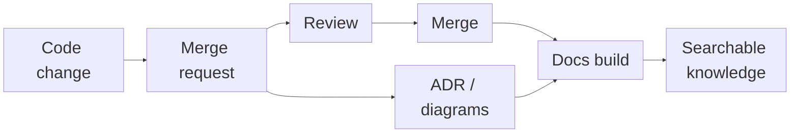
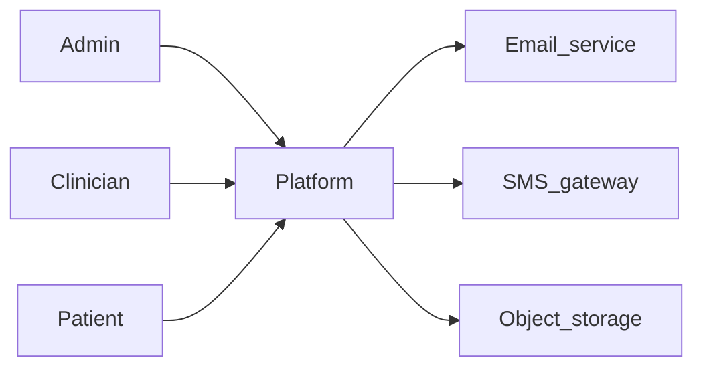
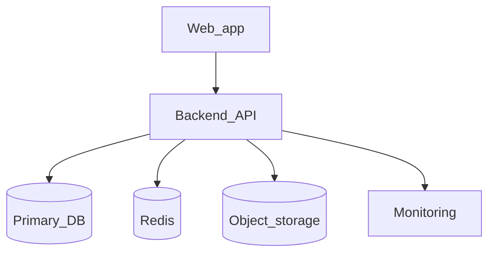
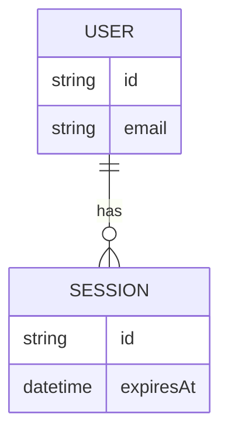
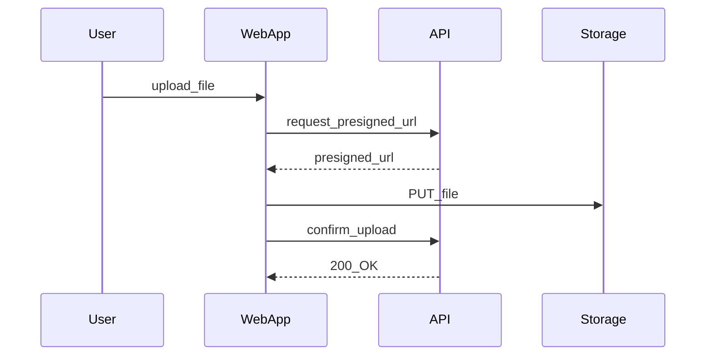
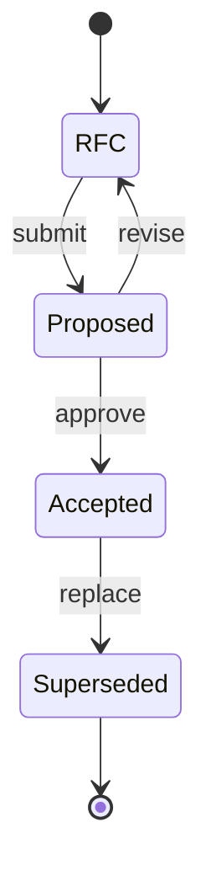
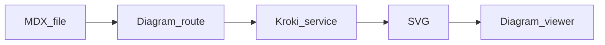
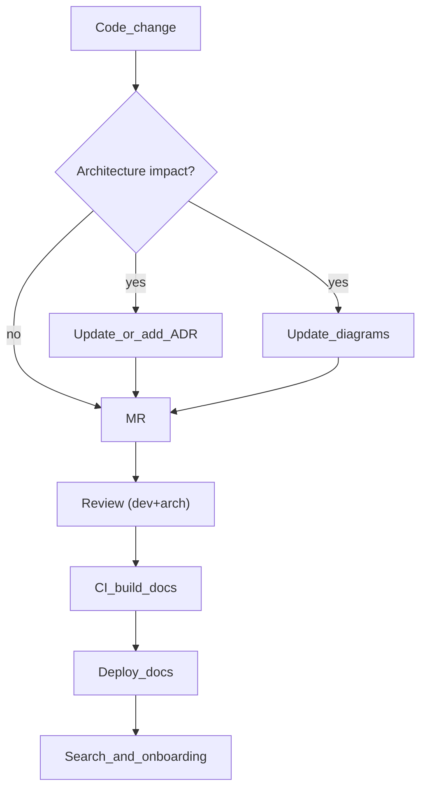

<div class="h-full w-full flex flex-col justify-center items-center text-center">

# Architecture as Code

## Як зробити архітектуру живою частиною розробки

<div class="mt-10 text-sm opacity-80">
  Vadym • 2026
</div>

</div>

<!--
Таймінг 30 хв (орієнтовно):
- 0–3: проблема і визначення
- 3–12: мінімальний набір артефактів + структура репо
- 12–18: C4/seq/ERD/state machine як код (діаграми)
- 18–20: Tech stack / Infra / Solutions
- 20–25: ADR і solution/
- 25–29: tooling (Fumadocs) + як зробити процес сталим + пастки
- 29–30: план впровадження + CTA + питання
-->

---
layout: default
---

## Кейс: Treemily (довготривалий проєкт)

- Проєкт тривав **роками**
- Цілісної архітектурної документації **не було**
- Архітектурні рішення жили “в головах” і в історії змін коду

<!--
2:00–2:40. Контекст: чому це взагалі стало проблемою.
-->

---
layout: default
---

## Онбординг без документації = висока вартість контексту

Коли нова людина питає “чому тут так?”, типові відповіді:
- **ніхто вже не памʼятає**
- **сідай — зараз розкажу історію**

Наслідки:
- повільніший онбординг
- більший bus factor
- вища ціна помилки

<!--
2:40–3:30. Показати pain без емоційної лексики.
-->

---
layout: default
---

## Травень 2025: “зробіть архітектурну документацію”

І виявилось, що потрібно:
- відновлювати контекст “з нуля” (рішення, інтеграції, межі компонентів)
- узгоджувати “мінімальний набір” артефактів
- визначити, **що саме** документувати

<div class="mt-8 p-5 rounded-xl bg-primary/15 border-2 border-primary/40 text-lg font-semibold">

**Висновок:** якщо архітектура не збирається **поступово**, одним таском її не “наздоженеш”.
</div>

<!--
3:30–4:10. Тригер, який змусив переосмислити підхід.
-->

---
layout: default
---

## Спочатку думали: Google Docs або Confluence

- Це звучить логічно: “напишемо один документ і буде ок”
- Але далі починається реальність:
  - немає природного **code review**
  - немає “diff” поруч із зміною в коді
  - важко тримати **актуальність**
  - нові люди не знають, **де шукати правду**

<!--
3:40–4:30. Показати, чому “звичайна вікі” не рятує.
-->

---
layout: default
---

## Architecture as Code

це підхід, коли архітектурні знання:

- зберігаються **в репозиторії** поруч із кодом
- проходять **ревʼю** як частина MR
- мають **історію змін** (git diff + blame)
- можуть перевірятись у **CI** (лінки, структура, генерація)

Результат: документація стає **частиною delivery**, а не “окремою ініціативою”.

---
layout: default
---

## Architecture as Code — як це працює

<!-- <div class="grid place-content-center min-h-[65vh] [&_.slidev-code]:!scale-[1.75]"> -->



<!-- </div> -->

<!--
4:30–5:30. Визначення + коротко “як це працює”.
-->

---
layout: two-cols-header
---

<div class="mb-8">
  <h2 class="!mb-2">Scope: про що це, а про що ні</h2>
  <p class="text-sm opacity-85 m-0">Чіткі межі підходу — щоб не було хибних очікувань</p>
</div>

::left::
#### У фокусі
- **Памʼять рішень** — ADR як частина MR
- **Спільні моделі** — C4, sequence, ERD (як код)
- **Словник термінів** — glossary = спільна мова
- **Процес і ownership** — хто оновлює, коли й як

::right::
#### Поза scope
- «Один великий документ на 100 сторінок»
- «Одна діаграма на старті проєкту»
- «Замінити дизайн чи код» — це доповнення, не заміна

<!--
4:00–5:00. Зняти хибні очікування.
-->

---
layout: default
---

## Артефакти, які ми вже впровадили

Мінімальний набір, який реально підтримується в роботі:

- **Glossary** — спільний словник термінів; домовленості команди як контракт
- **C4** — контекст і контейнери (C1 + C2) як основа архітектурної карти
- **ERD** — модель даних як джерело правди (у т.ч. для комплаєнсу)
- **Sequence + state machine** — ключові сценарії та життєвий цикл сутностей
- **Tech stack** — зафіксований стек і обґрунтування вибору
- **ADR** — архітектурні рішення та trade-offs (детальніше далі в презентації)

<!--
5:00–6:30. Пояснити “мінімум, який дає максимум”.
-->

---
layout: default
---

## Як це виглядає в репо (приклад структури)

```text
docs/
  content/docs/
    architecture/
      glossary/
      c4/
        c1.mdx
        c2.mdx
        c3/
      erd/
      seq/
      state-machine/
      tech-stack.mdx
      infrastructure.mdx
      solutions/
      adr/
        general/
        backend/
        data/
        security/
        infrastructure/
    process/
    api/
```

<!--
6:30–7:30. Показати, що це “звичайні файли”.
-->

---
layout: section
---

# Glossary

### терміни — це API вашої команди

<!-- 7:30–7:40 -->

---
layout: two-cols-header
---

<div class="mb-8">
  <h2 class="!mb-0">Glossary: чому ставимо першим</h2>
</div>

::left::
- Менше непорозумінь у MR/ревʼю (“actor”, “tenant”, “role”…)
- Швидший онбординг: “що означає слово X?”
- Єдине місце, де фіксуємо **доменно-специфічні** терміни
- Тримайте коротким: 1–3 речення + приклад + посилання

Ключ: термін у glossary має **посилатися** на діаграми/ADR, а не дублювати їх.

::right::
```md
### ClinicAdmin
Адміністратор, який керує налаштуваннями клініки.

**Не плутати з**: SuperAdmin
**Дивись також**: C4_C1, Tech_Stack
```

<!--
8:40–10:00. Glossary як фундамент для діаграм і ADR.
-->

---
layout: default
---

<div class="mb-8">
  <h2 class="!mb-0">Коли додавати та оновлювати терміни в glossary</h2>
</div>

- Зʼявився новий **actor / role / permission**
- Зʼявилась нова **сутність, стан або етап процесу**
- У MR або ревʼю виникли суперечки щодо назви — зафіксуйте термін
- Термін пішов у **API, БД або UI** — задекларуйте офіційну назву в glossary
- Є синоніми або схожі терміни — додайте блок «Не плутати з»

<!--
10:00–10:45. “Тригери” роблять glossary живим.
-->

---
layout: section
---

# Діаграми як код

### C4, ERD, sequence, state machine

<!-- 12:00–12:10 -->

---
layout: default
---

## C4 в 60 секунд

<div class="absolute top-8 right-10 opacity-95">
  
</div>

- **C1 (Context)**: актори + зовнішні інтеграції
- **C2 (Containers)**: з чого складається система (API, UI, DB, queue…)
- **C3 (Components)**: великі блоки всередині контейнерів

Ціль: **спільна модель** для розмов і рішень.

<!--
12:10–13:10. Дуже коротко.
-->

---
layout: two-cols
---

## C1: System Context (спрощений приклад)

::left::
Сильна сторона C1:

- одразу видно інтеграції
- одразу видно “хто наші користувачі”
- легше пояснювати “що ми будуємо”

::right::


<!--
13:10–14:30.
-->

---
layout: two-cols
---

## C2: Containers (спрощений приклад)

::left::
Що дає C2:

- залежності між “великими частинами”
- де живуть дані
- де кеш/черги/обсервабіліті

::right::


<!--
14:30–15:45.
-->

---
layout: two-cols
---

## ERD: де дані — там і архітектура

- **ERD (Entity-Relationship Diagram)** — діаграма сутностей і звʼязків у даних (таблиці/моделі та їхні відносини).
- Корисна, коли зʼявляються **аудит**, **комплаєнс** або складні доменні звʼязки
- ERD як файл → ревʼю, diff, історія

> ERD не замінює міграції, але рятує від “неочевидних” звʼязків.

::right::


<!--
15:45–16:30. Після C4: дані та звʼязки як основа для розмов.
-->

---
layout: two-cols
---

## Sequence: критичний флоу як код

::left::
Флоу, який має сенс документувати:

- auth/login
- forgot password
- large file upload
- consent/audit

Користь: видно **хто кого викликає** і де гарантії.

::right::


<!--
16:30–17:30.
-->

---
layout: two-cols
---

## State machine: allowed transitions як “контракт”

::left::
**State machine** — це опис станів і **дозволених переходів** між ними.

Навіщо:
- це стає **контрактом** між backend, frontend і QA
- не дає “тихих” багів типу *переходимо в стан, якого не повинно бути*
- спрощує валідації, edge-cases і тести

Приклад: статуси ADR (RFC → Proposed → Accepted → Superseded).

::right::


<!--
17:30–18:15. Завершуємо блок: transitions як контракт.
-->

---
layout: section
---

# Tech stack / Infrastructure / Solutions

### артефакти "після діаграм" у навігації

<!-- 24:00–24:10 -->

---
layout: default
---

## Tech stack / Infra / Solutions: що тут важливо

- **Tech stack**: 1 сторінка “що ми використовуємо і чому” + лінки на ADR
- **Infrastructure**: середовища, CI/CD, observability, compliance-обмеження
- **Solutions**: повторювані рішення для cross-cutting concerns (auth, audit, encryption, uploads…)

> У `meta.json` це йде **перед ADR**, бо створює контекст для рішень.

<!--
24:10–25:15. Коротко: ці сторінки дають контекст, без якого ADR буде “в повітрі”.
-->

---
layout: section
---

# ADR

### solution/ і рішення в навігації

<!-- 25:15–25:25 -->

---
layout: two-cols-header
---

## ADR: що має бути всередині (і коли писати)

:::left::
### Коли потрібен ADR
- Міняємо boundaries/контракти
- Додаємо інфраструктурний компонент (черги/кеш/observability)
- Обираємо технологію або підхід “надовго”

### Наслідки = чесні trade-offs
- **Positive / Negative / Risks**

:::right::
```md
---
title: "ADR-XXX: коротка назва"
status: Proposed
---

## Context
...

## Decision
...

## Consequences
### Positive
...
### Negative
...
### Risks
...
```

---
layout: two-cols
---

## ADR: життєвий цикл

:::left::
- **RFC** → **Proposed** → **Accepted** → **Superseded**
- Це не бюрократія: це контроль **стану знання**

:::right::


---
layout: default
---

## Демо: додати ADR за 5 хв

1. Створюємо файл `ADR-XXX` (шаблон)
2. Ставимо статус **Proposed**
3. Заповнюємо: Context / Decision / Consequences
4. Оновлюємо індекс ADR (таблиця або `meta.json`)
5. В MR:
   - 1–2 ревʼювери
   - якщо треба — оновлюємо C1/C2/seq/ERD

Результат: рішення стало **частиною історії коду**.

<!--
29:20–30:00. Фінальний push: “це робиться швидко”.
-->

---
layout: default
---
layout: section
---

# Tooling

### Чому Fumadocs

<!-- 26:15–26:25 -->

---
layout: default
---

## Чому документація “в коді” має шанс вижити

- Поруч з MR і review
- Має **ownership** і історію
- Searchable (і для людей, і для AI/LLM)
- Може мати автоматизації (індекси, лінки, генерацію)

Але потрібен інструмент, який **не заважає**.

<!--
26:25–27:30.
-->

---
layout: two-cols
---

## Fumadocs: сильні сторони для Architecture as Code

::left::
- Next.js + MDX
- Навігація через `meta.json`
- Пошук
- Гарний UI (dark/light)
- Компоненти для діаграм/вʼюверів

::right::
### Для команд
- легко почати
- легко стандартизувати
- легко оновлювати

> Головне: “правильний шлях” стає найпростішим.

<!--
27:30–28:30.
-->

---
layout: two-cols
---

## Mermaid + PlantUML: коли що використовувати

::left::
### Mermaid
- швидко
- достатньо для C4/flow/seq
- прямо в MD/MDX

### PlantUML
- коли потрібна UML-нотація
- ERD/seq на складні системи

::right::


<!--
28:30–29:00.
-->

---
layout: default
---

## Docs pipeline: як зробити знання “видимим” у процесі



<!--
29:00–29:30. Це “architecture as code” як процес.
-->

---

# Щоб це не померло

### правила і ownership

<!-- 26:00–26:10 -->

---
layout: default
---

## MR checklist (коротко і жорстко)

- Якщо міняю boundaries/контракти → **ADR (фіксуємо рішення) або діаграма** в тому ж MR
- Якщо додаю сервіс/інтеграцію → оновити **C1/C2**
- Якщо міняю дані → оновити **ERD**
- Якщо міняю критичний флоу → оновити **sequence**

> Нехай CI не блокує, але checklist має бути “соціальним контрактом”.

<!--
26:10–27:30.
-->

---
layout: default
---

## Ownership: хто відповідає за якість знання

- Власник розділу `architecture/*` (це role, не “титул”)
- Ревʼю ADR: 1 domain + 1 platform
- “Садівник” раз на квартал: прибрати/оновити superseded

Мета: **зменшити ентропію**.

<!--
27:30–28:30.
-->

---
layout: default
---

## Пастки (і як їх уникнути)

- **Overdocumentation** → почни з мінімуму
- “Діаграми для галочки” → діаграма має відповідати на питання
- Немає ownership → знання гниє
- Немає тригерів → ніхто не фіксує рішення (ADR)
- Немає пошуку/навігації → ніхто не читає

<!--
28:30–29:15.
-->

---
layout: section
---

## План впровадження (1 тиждень)

- День 1: додайте структуру `architecture/*`
- День 2: напишіть **3 ADR** (stack, auth, storage)
- День 3: зробіть **C1 + C2**
- День 4: 1 sequence для найкритичнішого флоу
- День 5: введіть MR checklist + ownership

Потім: “садівник” раз на квартал.

<!--
29:15–29:45. Дати чіткі кроки.
-->

---
layout: two-cols
---

## Далі що? (і де подивитись)

::left::
### Лінки
- [Fumadocs](https://fumadocs.dev)
- Ваш репозиторій/темплейт: `https://github.com/ORG/REPO`
- Слайди: `https://example.com/slides`

> Порада: зробіть **перший ADR** уже в наступному MR.

::right::
<div class="flex flex-col items-center gap-6">
  <div class="text-sm opacity-80">Fumadocs</div>
  <QrLink value="https://fumadocs.dev" :size="180" />
  <div class="text-sm opacity-80">Ваш template/репо</div>
  <QrLink value="https://github.com/ORG/REPO" :size="180" />
</div>

<!--
29:45–30:00. CTA.
-->

---
layout: end
---

# Дякую!

## Питання?

<style>
:root {
  --slidev-code-font-size: 0.9em;
}

h1, h2, h3 {
  letter-spacing: -0.02em;
}
</style>